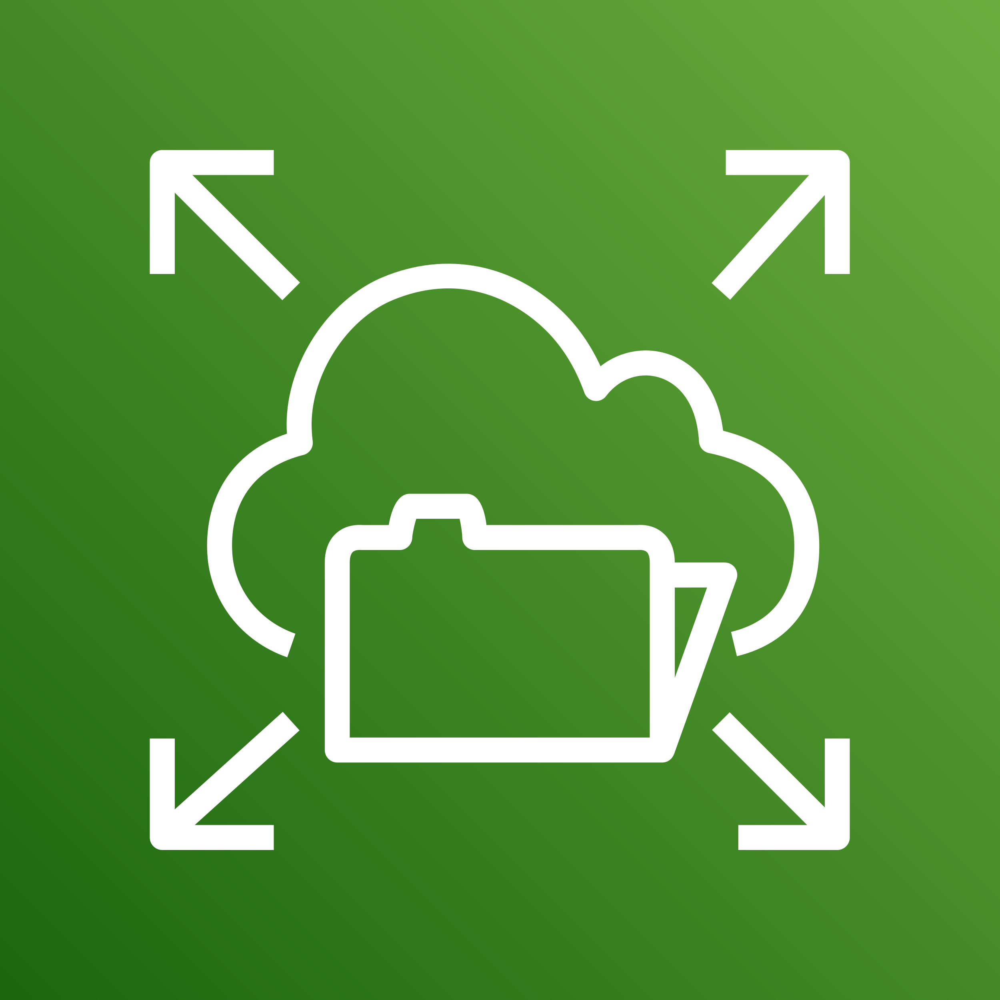

# Projeto 2 - WordPress em Alta Disponibilidade na AWS

 

<br>

Este repositório documenta a implementação de uma arquitetura resiliente, segura e escalável para hospedar um site WordPress na nuvem da Amazon Web Services (AWS), baseada no diagrama acima. A infraestrutura é distribuída em múltiplas Zonas de Disponibilidade (AZs) para garantir alta disponibilidade e utiliza um Auto Scaling Group para se adaptar dinamicamente à carga de tráfego.

<div align="center">
  <a href="https://skillicons.dev">
    
  </a>
</div>

## Tabela de Conteúdo

1.  [Visão Geral do Projeto](#1-visão-geral-do-projeto)
2.  [Etapa 1: Fundação da Rede (VPC)](#2-etapa-1-fundação-da-rede-vpc)  
    * [Criar a VPC e as Sub-redes](#criar-a-vpc-e-as-sub-redes)
    * [Criar Internet Gateway e NAT Gateway](#criar-internet-gateway-e-nat-gateway)
    * [Configurar Tabelas de Rotas](#configurar-tabelas-de-rotas)
3.  [Etapa 2: Camada de Dados (EFS e RDS)](#3-etapa-2-camada-de-dados-efs-e-rds)   
    * [Criar Grupos de Segurança](#criar-grupos-de-segurança-security-groups)
    * [Criar Sistema de Arquivos (EFS)](#criar-sistema-de-arquivos-efs)
    * [Criar Banco de Dados (RDS)](#criar-banco-de-dados-rds)
4.  [Etapa 3: Camada de Aplicação (EC2, ASG, ALB)](#4-etapa-3-camada-de-aplicação-ec2-asg-alb)    
    * [Criar Launch Template com User Data (Docker)](#criar-launch-template-com-user-data-docker)
    * [Criar Auto Scaling Group (ASG)](#criar-auto-scaling-group-asg)
    * [Criar Application Load Balancer (ALB)](#criar-application-load-balancer-alb)
5.  [Etapa 4: Conexão Final e Teste](#5-etapa-4-conexão-final-e-teste)
    * [Conectar ASG ao ALB](#conectar-asg-ao-alb)
    * [Configurar Regras Finais de Segurança](#configurar-regras-finais-de-segurança)
    * [Acessar e Testar o Site](#acessar-e-testar-o-site)
6.  [Bônus: Automação com Terraform](#6-bônus-automação-com-terraform)
    * [Visão Geral e Pré-requisitos](#visão-geral-e-pré-requisitos)
    * [Estrutura dos Arquivos](#estrutura-dos-arquivos)
    * [Como Executar](#como-executar)

---

## 1. Visão Geral do Projeto

Este projeto implementa uma solução completa para hospedar o WordPress na AWS, focando em:
* **Alta Disponibilidade:** Recursos distribuídos em duas Zonas de Disponibilidade para tolerância a falhas.
* **Escalabilidade:** Um Auto Scaling Group ajusta o número de servidores web com base na demanda.
* **Segurança:** Uma arquitetura de 3 camadas (pública, aplicação, dados) com sub-redes isoladas e regras de firewall específicas para proteger a aplicação e o banco de dados.
* **Dados Persistentes e Compartilhados:** Uso do Amazon EFS para que os arquivos do WordPress (mídia, plugins, temas) sejam compartilhados entre todas as instâncias e do Amazon RDS para um banco de dados gerenciado e resiliente.
* **Automação:** Implantação da aplicação conteinerizada com Docker através de um script de `user-data` e, como bônus, a automação completa da infraestrutura com Terraform.

---

## 2. Etapa 1: Fundação da Rede (VPC)

Configuração da infraestrutura de rede isolada na AWS para nossa instância.

### Criar a VPC e as Sub-redes

1.  No console da AWS, navegue até o serviço **VPC**.
2.  Clique em "VPCs" e depois em "Criar VPC".
    * **Nome:** `wp-vpc`
    * **Bloco CIDR IPv4:** `10.0.0.0/16`
3.  Em "Sub-redes", crie 6 sub-redes dentro da `wp-vpc`, em 2 Zonas de Disponibilidade (ex: `us-east-2a`, `us-east-2b`):
    * **2 Sub-redes Públicas:** `10.0.1.0/24` e `10.0.2.0/24`
    * **2 Sub-redes Privadas 'App':** `10.0.10.0/24` e `10.0.11.0/24`
    * **2 Sub-redes Privadas 'Data':** `10.0.20.0/24` e `10.0.21.0/24`

### Criar Internet Gateway e NAT Gateway

1.  No painel da VPC, crie um **Internet Gateway** (ex: `wp-igw`) e anexe-o à sua `wp-vpc`.
2.  Crie um **NAT Gateway** em uma das sub-redes públicas (ex: na `10.0.1.0/24`) e aloque um novo IP Elástico para ele.

### Configurar Tabelas de Rotas

1.  Crie uma **Tabela de Rota Pública** (ex: `wp-rtb-public`):
    * Adicione uma rota de destino `0.0.0.0/0` com o alvo no seu Internet Gateway.
    * Associe esta tabela às suas **duas sub-redes públicas**.
2.  Crie uma **Tabela de Rota Privada 'App'** (ex: `wp-rtb-app`):
    * Adicione uma rota de destino `0.0.0.0/0` com o alvo no seu NAT Gateway.
    * Associe esta tabela às suas **duas sub-redes 'App'**.
3.  Crie uma **Tabela de Rota Privada 'Data'** (ex: `wp-rtb-data`):
    * **Não adicione** nenhuma rota para a internet.
    * Associe esta tabela às suas **duas sub-redes 'Data'**.

---

## 3. Etapa 2: Camada de Dados (EFS e RDS)

Provisionamento dos serviços de armazenamento persistente.

### Criar Grupos de Segurança (Security Groups)

1.  No painel do EC2, em "Grupos de Segurança", crie 4 novos grupos na sua `wp-vpc`:
    * `alb-sg`: Para o Load Balancer.
    * `app-sg`: Para as instâncias da aplicação.
    * `rds-sg`: Para o banco de dados.
    * `efs-sg`: Para o sistema de arquivos.

### Criar Sistema de Arquivos (EFS)

1.  No console do **EFS**, crie um novo sistema de arquivos (ex: `wordpress-efs`).
2.  Na configuração de rede, crie "Mount Targets" (pontos de acesso) em cada uma das **sub-redes 'Data' privadas**.
3.  Associe o `efs-sg` a estes Mount Targets.

### Criar Banco de Dados (RDS)

1.  No console do **RDS**, vá em "Grupos de sub-redes" e crie um novo grupo (ex: `wp-data-subnet-group`). Adicione apenas as **duas sub-redes 'Data' privadas** a este grupo.
2.  Vá em "Bancos de dados" e clique em "Criar banco de dados".
    * **Motor:** `MySQL` ou `MariaDB`.
    * **Modelo:** `Nível gratuito`.
    * **Credenciais:** Defina um usuário e senha (guarde-os com segurança).
    * **Conectividade:**
        * **VPC:** `wp-vpc`.
        * **Grupo de sub-redes:** Selecione o `wp-data-subnet-group` que você criou.
        * **Acesso público:** **Não**.
        * **Grupo de segurança:** Escolha "Selecionar existente" e selecione o `rds-sg`.
    * **Configuração Adicional:** Dê um nome inicial ao banco, como `wordpress_db`.

---

## 4. Etapa 3: Camada de Aplicação (EC2, ASG, ALB)

Criação dos recursos que irão executar e servir a aplicação.

### Criar Launch Template com User Data (Docker Compose)

1.  No console do **EC2**, vá em "Launch Templates" e crie um novo (ex: `wordpress-template`).
2.  **AMI:** `Ubuntu Server LTS` (x86).
3.  **Tipo de Instância:** `t2.micro`.
4.  **Par de Chaves:** Selecione o seu par de chaves.
5.  **Configurações de Rede:**
    * **NÃO** selecione uma sub-rede.
    * **Grupo de Segurança:** Selecione o `app-sg`.
6.  **Tags:** Adicione as tags necessárias.
7.  **Detalhes Avançados -> User data:** Cole o script de inicialização para instalar o Docker, criar o arquivo .yml e executar o container do WordPress, utilizando do EFS e RDS.

### Criar Auto Scaling Group (ASG)

1.  No console do **EC2**, vá em "Grupos do Auto Scaling" e crie um novo (ex: `wordpress-asg`).
2.  **Launch Template:** Selecione o `wordpress-template` criado acima.
3.  **Rede:** Selecione as **duas sub-redes 'App' privadas**.
4.  **Tamanho do Grupo:** Defina a capacidade desejada/mínima como `2` e a máxima como `4`.

### Criar Application Load Balancer (ALB)

1.  No console do **EC2**, vá em "Load Balancers" e crie um novo Application Load Balancer (ex: `wordpress-alb`).
2.  **Esquema:** `Internet-facing`.
3.  **Rede:** Selecione a `wp-vpc` e as **duas sub-redes públicas**.
4.  **Grupo de Segurança:** Selecione o `alb-sg`.
5.  **Listener:** Crie um **Target Group** (ex: `wordpress-tg`) para instâncias na porta 80. Não registre nenhum alvo manualmente.

---

## 5. Etapa 4: Conexão Final e Teste

Conexão das peças e validação da arquitetura.

### Conectar ASG ao ALB

1.  Edite o **Auto Scaling Group** e, na seção de balanceamento de carga, associe-o ao **Target Group** (`wordpress-tg`).
2.  Aguarde alguns minutos e verifique no Target Group se as instâncias foram registradas e se o status de saúde está "healthy".

### Configurar Regras Finais de Segurança

1.  No console do **EC2**, vá em "Grupos de Segurança".
2.  **Edite o `app-sg`:** Adicione uma regra de entrada permitindo tráfego **HTTP (porta 80)** vindo da **Origem `alb-sg`**.
3.  **Edite o `rds-sg`:** Adicione uma regra de entrada permitindo tráfego **MYSQL/Aurora (porta 3306)** vindo da **Origem `app-sg`**.
4.  **Edite o `efs-sg`:** Adicione uma regra de entrada permitindo tráfego **NFS (porta 2049)** vindo da **Origem `app-sg`**.

### Acessar e Testar o Site

1.  Vá na página de "Load Balancers" e copie o **Nome DNS** do seu `wordpress-alb`.
2.  Cole o endereço no seu navegador.
3.  A página de instalação do WordPress deve aparecer. Complete os passos para finalizar a configuração.

---

## 6. Bônus: Automação com Terraform

* No script do Terraform, a infraestrutura é criada/destruída TOTALMENTE, em uma aplicação real, estruturas como, RDS, EFS, SGs, etc. devem ser persistentes

A construção manual é um ótimo exercício de aprendizado, mas a automação com Infraestrutura como Código (IaC) é a prática profissional padrão. Usamos o Terraform para descrever toda a arquitetura acima em código, permitindo a criação e destruição de todo o ambiente com poucos comandos.

### Visão Geral e Pré-requisitos
1.  **Instalar o Terraform:** Siga o guia oficial da HashiCorp.
2.  **Instalar e Configurar o AWS CLI:** Instale o CLI v2 e configure o acesso à sua conta AWS, preferencialmente usando o método seguro com `aws configure sso`.

### Estrutura dos Arquivos
O projeto foi organizado nos seguintes arquivos:
* [`main.tf`](https://github.com/bruno-pedron/Projeto2_WordPress/blob/main/Terraform/main.tf): Contém a definição de todos os recursos da AWS (VPC, instâncias, etc.).
* [`variables.tf`](https://github.com/bruno-pedron/Projeto2_WordPress/blob/main/Terraform/variables.tf): Declara as variáveis de entrada, como a senha do banco de dados.
* [`outputs.tf`](https://github.com/bruno-pedron/Projeto2_WordPress/blob/main/Terraform/outputs.tf): Declara as saídas, como o endereço DNS do Load Balancer.
* [`user_data.sh.tpl`](https://github.com/bruno-pedron/Projeto2_WordPress/blob/main/Terraform/user_data.sh.tpl.tf): O template do script de inicialização das instâncias EC2.

### Como Executar
1.  Navegue até a pasta do projeto no seu terminal.
2.  Para se autenticar (se estiver usando SSO e a sessão expirou):
    ```bash
    aws sso login
    ```
3.  Exporte a variável de ambiente do perfil da AWS:
    ```bash
    export AWS_PROFILE=NomeDoSeuPerfil
    ```
4.  Inicialize o Terraform (apenas na primeira vez ou se adicionar novos provedores):
    ```bash
    terraform init
    ```
5.  Planeje e revise as alterações:
    ```bash
    terraform plan
    ```
6.  Aplique e construa a infraestrutura (ele pedirá a senha do banco de dados):
    ```bash
    terraform apply
    ```
7.  Para destruir toda a infraestrutura e zerar os custos:
    ```bash
    terraform destroy
    ```
